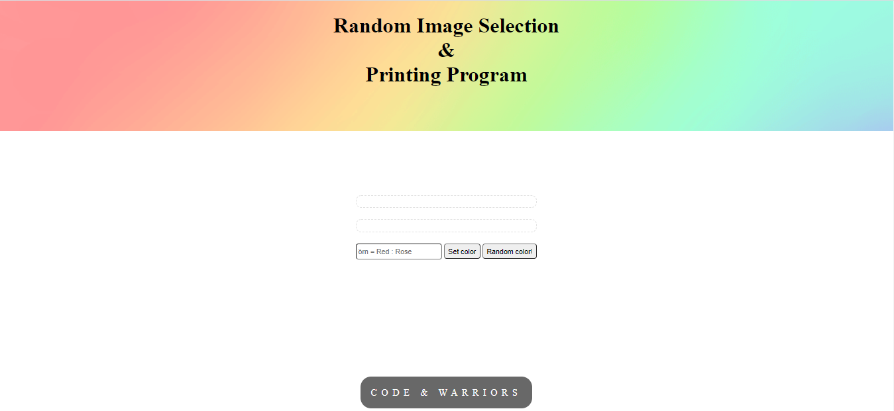
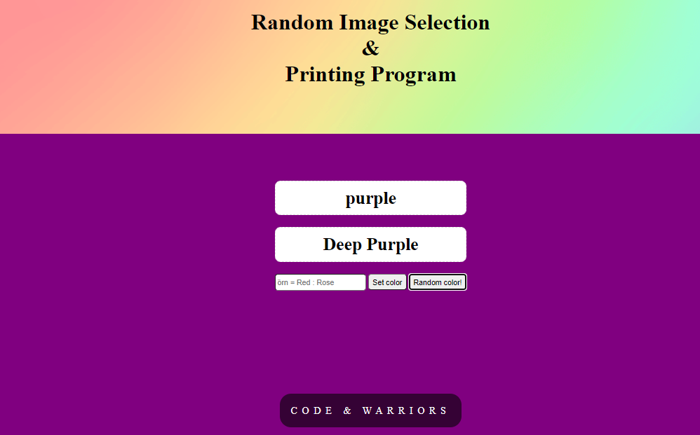

<h1 align="center">Color-Changer</h1>

link : https://talha-35.github.io/Color-Changer/.

random image selection and printing program

## Description

  Random image selection and printing Programm ...

   Zufälliges Bildauswahl- und Druckprogramm ...

## These are short promotional photos about this app

 


### At the end of the project, following topics are to be covered;

- HTML
- CSS
- JS

## How To Use


```bash

$ git clone https://github.com/Talha-35/Color-Changer.git

```
## Contact

- GitHub [@Talha](https://github.com/Talha-35)
- Linkedin [@Talha](https://www.linkedin.com/in/talha-%C3%BClk%C3%BCmen-4854391b8/)

